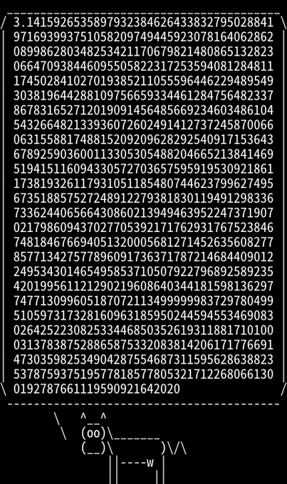

% HarunachanBlog

# 円周率シェル芸

円周率を求めるシェル芸。

インデントを崩せばシェル芸botで実行可能。

```sh
python -c "
from decimal import Decimal as D
from decimal import *
getcontext().prec=999
a=D(1)
b=D(1)/D(2).sqrt()
t=D(0.25)
p=D(1)
for i in range(999):
  e=(a+b)/D(2)
  f=(a*b).sqrt()
  g=t-p*(a-e)**2
  h=D(2)*p
  a=e
  b=f
  t=g
  p=h
print((a+b)**2/(D(4)*t))" | cowsay | textimg -s
```


[ホームへ](https://harunachan.com/)
